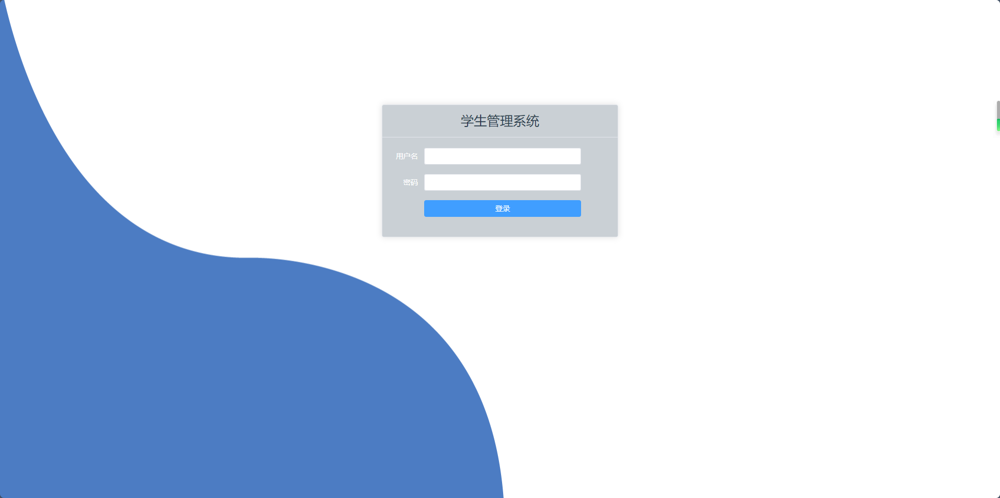
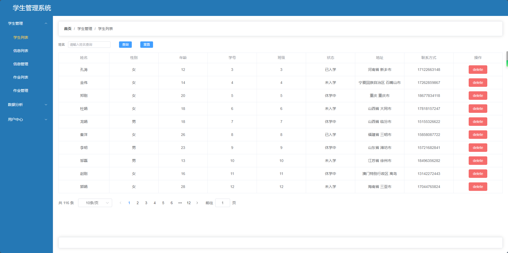
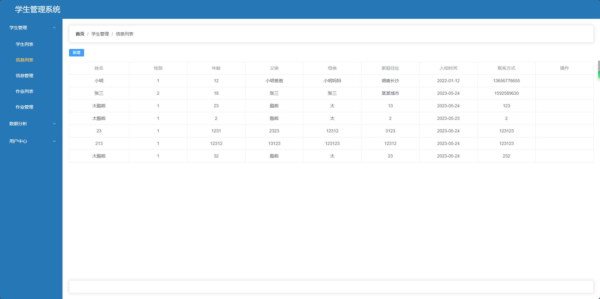
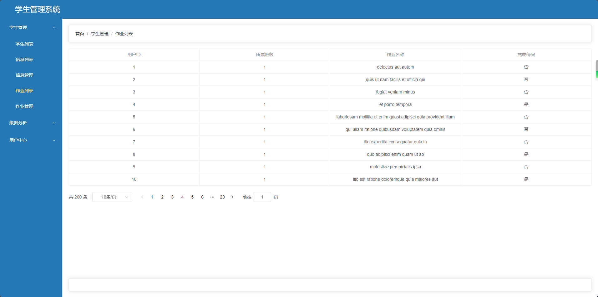
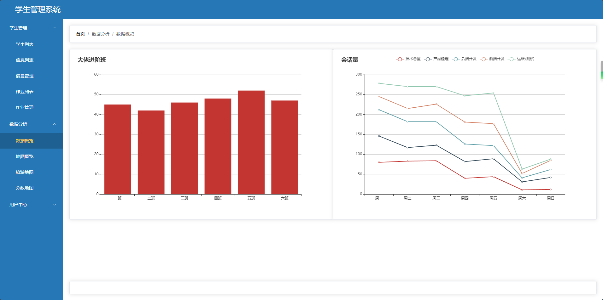
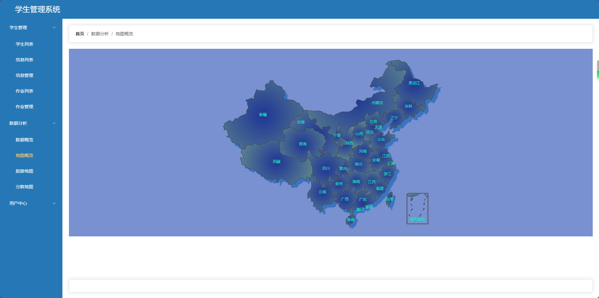
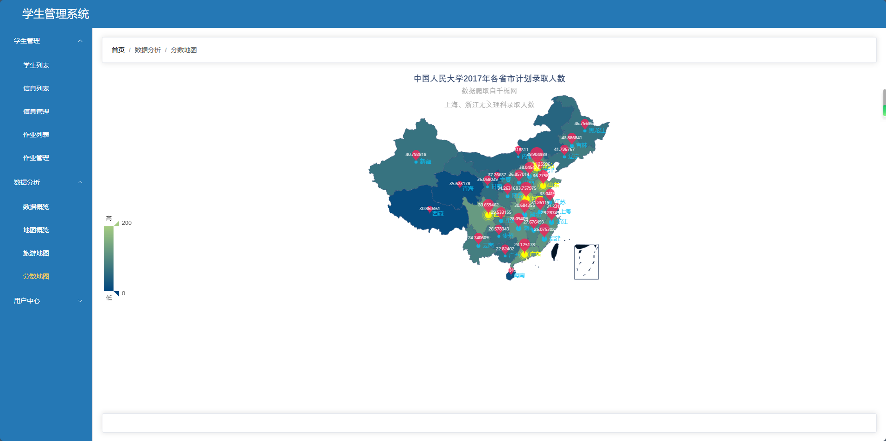

## 学生管理系统

### 项目简介
&emsp;&emsp;该项目是一个用于学校教务管理的后台系统，包括了学生信息管理、课程管理、成绩管理、班级管理等多个功能模块。
### 开发环境
&emsp;&emsp;1. WebStorm 2023.1

&emsp;&emsp;2. Vue3

&emsp;&emsp;3. Element-Plus
### 安装步骤
```
yarn install
```
### 前端展示









### 目录结构
```shell
├─node_modules
├─public                不需要被打包的静态资源文件
└─src                   核心源代码文件
    ├─api               与服务器进行数据交互的API相关的文件
    ├─assets            静态资源文件
    │  └─css            样式表文件
    ├─components        组件文件
    │  ├─common         公用组件文件
    │  ├─dataAnalysis   数据分析相关组件文件
    │  ├─students       学生相关组件文件
    │  └─users          用户相关组件文件
    ├─router            路由文件
    └─utils             工具类文件
```
